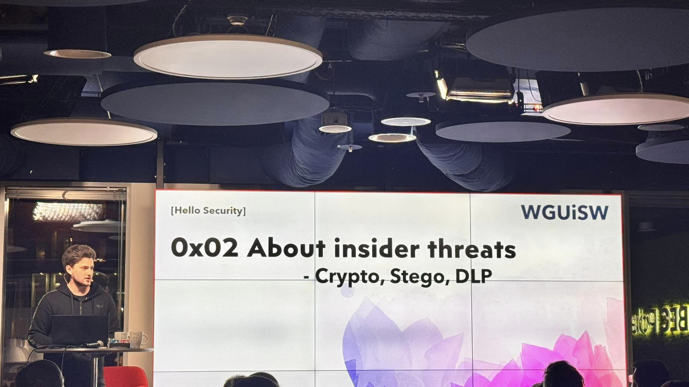

**_Disclaimer:_** _You are free to use presented knowledge for educational purposes, with good intentions (penetration testing, ctf’s etc.), or not._ **_I am not responsible for anything you do._**

# WGUiSW Event - [Hello Security]

> On February 6th 2024, I gave a talk on Insider Threats, Cryptography, Steganography, and DLP evasion during WGUISW 157th conference in BEC Poland, Warsaw, as part two of the [Hello Security] series dedicated to extend cyber-security awareness.

---
## Agenda

- 0x02 About insider threats - Crypto, Stego, DLP 
- 0x03 Whoami
- 0x04 Insider Threats
- 0x05 Advanced Persistent Threats
- 0x06 Bad USB attacks
- 0x07 Cryptography - Caesar Cipher
- 0x08 Cryptography - Vigenere Cipher 
- 0x09 Cryptography - Affine Cipher
- 0x0A Cryptography - Hill Cipher
- 0x0B Cryptography - Rijndael Block Cipher
- 0x0C Cryptography - bitwise XOR
- 0x0D Steganography
- 0x0E Internal threat live crypto-example
- 0x0F Falling into a rabbit hole
- 0x10 Q&A
- 0x11 Thank you

## [Download](assets/About_Insider_Threats-Crypto_Stego_DLP_2024.pdf "Download")

The presentation in PDF format can be downloaded [here](assets/About_Insider_Threats-Crypto_Stego_DLP_2024.pdf "here").

The source code can be viewed [here](https://github.com/krystianbajno/articles/tree/main/0x07%20About%20Insider%20Threats.%20Crypto%2C%20Stego%2C%20DLP/src "here").

---
# What is WGUiSW?

[WGUiSW](http://www.wguisw.org) is a community dedicated to Microsoft professionals and users, organised by [Paweł Pławiak](https://www.linkedin.com/in/pplawiak/), CEO of [CBSG Polska](https://www.cbsg.pl/), the official Microsoft partner.

The [WGUISW](http://www.wguisw.org) community event offers a great platform for professionals to connect and discuss their interests in technology. Attendees had the opportunity to engage in meaningful conversations, share perspectives, and build valuable relationships.

## Join [WGUiSW](http://www.wguisw.org)
Don't miss out! Join WGUISW every second Tuesday of the month at [wguisw.org](http://www.wguisw.org).

K.